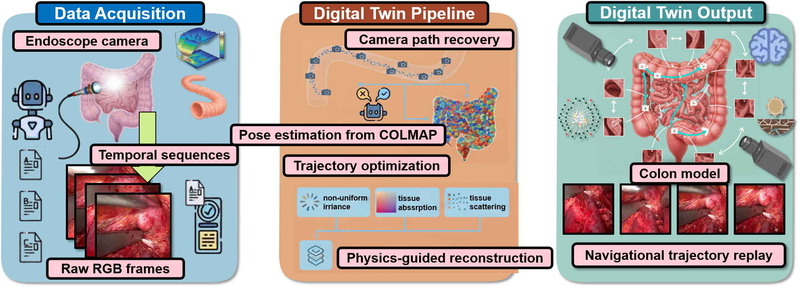

# OptiEndoGS:Decoupling Optical Degradation and Appearance Modulation for High-FidelityEndoscopic 3D Gaussian Reconstruction

This repo contains code for the paper "3D-UIR: OptiEndoGS:Decoupling Optical Degradation and Appearance Modulation for High-FidelityEndoscopic 3D Gaussian Reconstruction"


#  Installation

Please clone our repository and change to that folder
```python
git clone https://github.com/IMOP-lab/OptiEndoGS.git
cd OptiEndoGS
```
Create a new python environment and install relevant requirements(Among them, the three libraries of diff-gaussian-rasterization, simple-knn and fused-ssim are downloaded from https://bilityniu.github.io/3D-UIR.)
```python
conda create -n OptiEndoGS python=3.8
conda activate OptiEndoGS
pip install torch==2.0.1 torchvision==0.15.2 torchaudio==2.0.2 --index-url https://download.pytorch.org/whl/cu118
conda install cudatoolkit-dev=11.8 -c conda-forge

mkdir submodules
cd submodules
mkdir diff-gaussian-rasterization
mkdir simple-knn
mkdir fused-ssim
pip install submodules/diff-gaussian-rasterization/
pip install submodules/simple-knn/
pip install submodules/fused-ssim/
```
## Training and Evaluation

### Training

To run the optimizer, simply use:
```python
python train.py -s <path to COLMAP or NeRF Synthetic dataset>
```

### Evaluation and Rendering

```python
# Train with train/test split
python train.py -s <path to COLMAP or NeRF Synthetic dataset> --eval

# Generate renderings
python render.py -m <path to trained model>

# Compute error metrics on renderings
python metrics.py -m <path to trained model>

```

## Dataset

### Dataset Format
Our COLMAP loaders expect the following dataset structure in the source path location:
```
<location>
|---images
|   |---<image 0>
|   |---<image 1>
|   |---...
|---sparse
    |---0
        |---cameras.bin
        |---images.bin
        |---points3D.bin
```

## 📮Contact

Feel free to contact us at **2273860887@qq.com** for any questions or collaborations!

